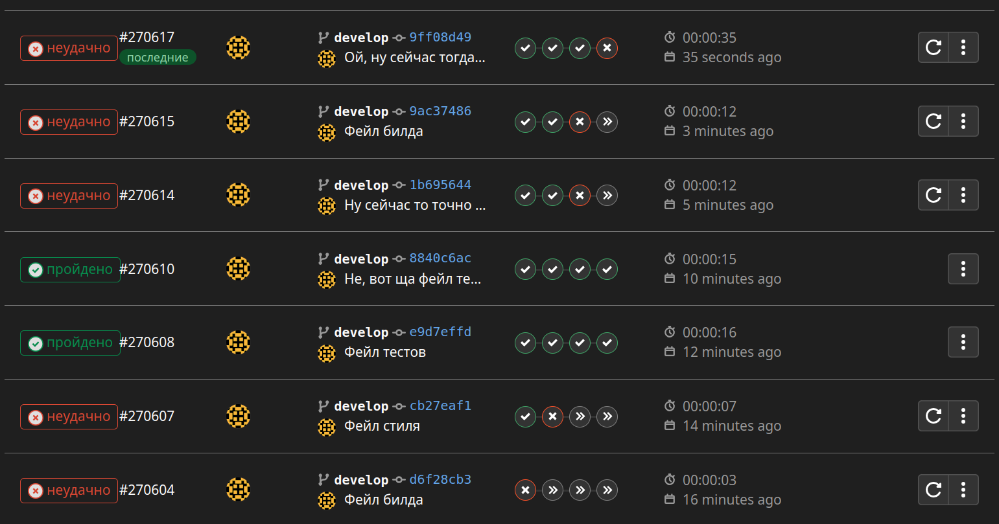
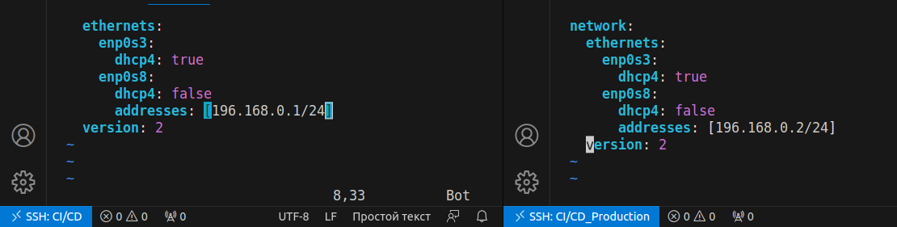
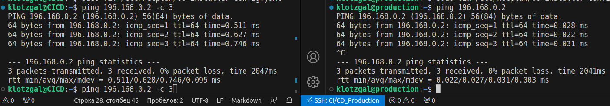
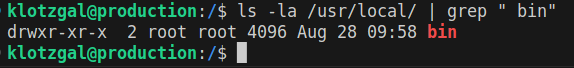
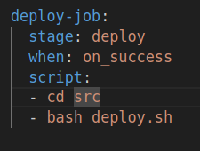
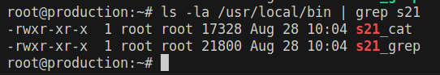
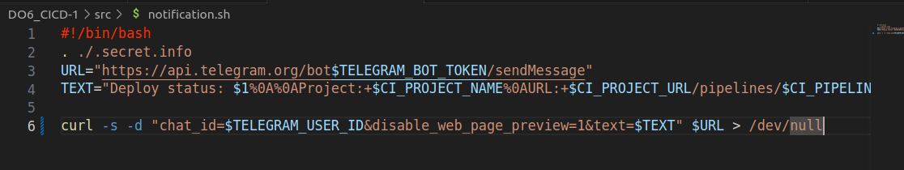
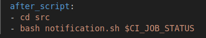
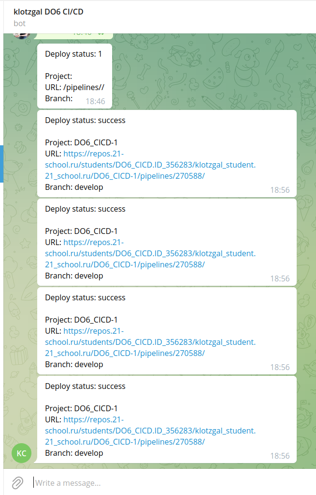

# Basic CI/CD

### Part 1. Настройка **gitlab-runner**

##### Поднять виртуальную машину *Ubuntu Server 20.04 LTS*
##### Скачать и установить на виртуальную машину **gitlab-runner**

  1. curl -L "https://packages.gitlab.com/install/repositories/runner/gitlab-runner/script.deb.sh" | sudo bash
  2. sudo apt-get install gitlab-runner

##### Запустить **gitlab-runner** и зарегистрировать его для использования в текущем проекте (*DO6_CICD*)

  1. sudo gitlab-runner register
  2. Ввел URL сервера, токен, название ранера (CI/CD for SimpleBashUtils), тег (Node1) и исполнителя (shell)

### Part 2-4. Сборка, Тест кодстайла, Интеграционные тесты
  Написал .gitlab-ci.yml файл и протестировал работу пайплайна.
  й. Протестировал что пайплайн фейлится где при ошибках.

  

### Part 5. Этап деплоя

##### Поднять вторую виртуальную машину *Ubuntu Server 20.04 LTS*

#### Написать этап для **CD**, который "разворачивает" проект на другой виртуальной машине:
1. Добавил на каждой машине адаптер для внутренней сети
2. Настроил конфишурацию netplan так, чтобы машины находились в одной сети

3. Проверил ping

##### Запускать этот этап вручную при условии, что все предыдущие этапы прошли успешно

##### Написать bash-скрипт, который при помощи **ssh** и **scp** копирует файлы, полученные после сборки (артефакты), в директорию */usr/local/bin* второй виртуальной машины

1. Первым этапом нужно создать ssh ключ от пользователя root, так как gitlab-runner запускается от этого пользователя.
  - sudo -su gitlab-runner
  - ssh-keygen
2. Вывести публичный ключ для того, чтобы потом добавить его на вторую машину
  - cat ~/.ssh/id_rsa.pub
3. На второй машине зайти под root и добавить ключ первой машины в authorized_keys
  - sudo -i
  - vim ~/.ssh/authorized_keys
4. Вставил ключ с первой машины
5. Важно первый раз запустить скрипт вручную, т.к. в первый раз нужно бедет ввести "yes" чтобы запомнить соединение.
6. Далее написал deploy.sh, состоящий из одной строчки:
  - scp SimpleBashUtils/cat/s21_cat SimpleBashUtils/grep/s21_grep root@196.168.0.2:/usr/local/bin/
7. scp(Secure Copy Protocol) как понятно из названия служит для копирования файлов между компьютерами. В данном случае он копирует артефакты созданные на этапе build на сервер 196.168.0.2 в папку /usr/local/bin, подключаясь от root. При этом права на папку /usr/local/bin/ на втором сервере остаются только у root:
  

##### В файле _gitlab-ci.yml_ добавить этап запуска написанного скрипта
  - 

##### В случае ошибки "зафейлить" пайплайн

В результате вы должны получить готовые к работе приложения из проекта *C2_SimpleBashUtils* (s21_cat и s21_grep) на второй виртуальной машине.
  

### Part 6. Дополнительно. Уведомления

##### Настроить уведомления о успешном/неуспешном выполнении пайплайна через бота с именем "[ваш nickname] DO6 CI/CD" в *Telegram*

- Текст уведомления должен содержать информацию об успешности прохождения как этапа **CI**, так и этапа **CD**.
- В остальном текст уведомления может быть произвольным.

1. Создал телеграм бота
  - 
2. Написал bash скрипт для отправки уведомлений
  - 
3. Добавил после каждого этапа запуск скрипта. Аргумент CI_JOB_STATUS созержит в себе статус выполнения текущего задания
  - 
4. После запуска пайплайна бот отправляет уведомления
  - 

